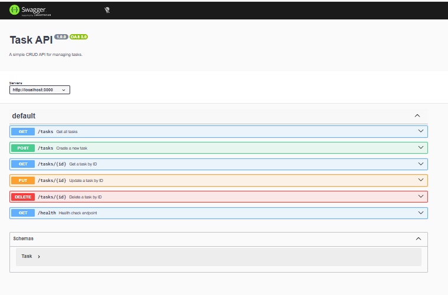

# Task API

A simple REST API built with Express.js that supports CRUD operations for tasks.

## Features

- Create a task
- Get all tasks
- Get a task by ID
- Update a task
- Delete a task
- Swagger UI documentation

## API Documentation

Open the Swagger UI at:

http://localhost:3010/api-docs

## Swagger UI

